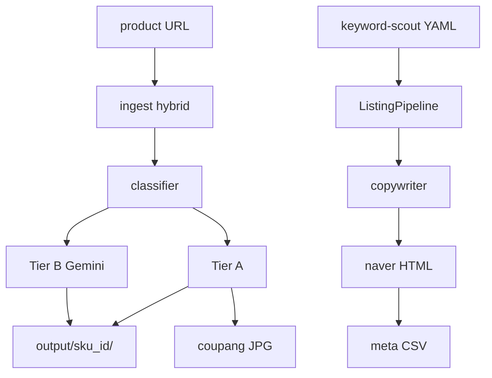

# Architecture — listing-forge

## 1. Context (A-1)

| 항목 | 내용 |
|---|---|
| **규모** | 1인 · CLI MVP → 로컬 웹 |
| **스타일** | **pipeline** (keyword-scout 동형) |
| **한 줄** | URL + keyword YAML → 수집 → 이미지 2단 → HTML/JPG 산출 |

**North Star**: clip-lens-page 수동 워크플로 **80% 자동화**.

## 2. Components (A-2)

| 컴포넌트 | 역할 | 경로 |
|---|---|---|
| **Config** | listing.yaml · env | `config/listing.yaml` |
| **CLI** | ingest / build | `scripts/build_listing.py` |
| **PublicParser** | og:image · JSON-LD · 알리 runParams | `src/ingest/public_parser.py` |
| **PlaywrightFetcher** | 로그인 세션 폴백 | `src/ingest/playwright_fetcher.py` |
| **ManualDrop** | ZIP/URL 목록 수동 | `src/ingest/manual_drop.py` |
| **ImageClassifier** | gallery/detail/junk · Tier A/B | `src/process/classifier.py` |
| **GeminiClient** | Tier B · 카피 | `src/process/gemini_client.py` |
| **NaverRenderer** | Jinja HTML 2종 | `src/render/naver_html.py` |
| **CoupangExporter** | JPG 네이밍 | `src/render/coupang_jpeg.py` |
| **CsvMeta** | 네이버 CSV | `src/render/csv_meta.py` |
| **Pipeline** | 오케스트레이션 | `src/pipeline.py` |
| **Reference** | clip-lens 샘플 | `reference/clip-lens-sample/` |

## 3. Data flow (A-3)

## 4. Trade-offs (A-4)

| 결정 | 선택 | 이유 |
|---|---|---|
| 수집 | hybrid 3단 | 봇 차단·1688 로그인 |
| 이미지 | Tier A/B 분리 | clip-lens 운영 경험 |
| UI | CLI 먼저 | keyword-scout 패턴 재사용 |
| 템플릿 | Jinja2 + reference HTML | naver-detail.html 검증됨 |
| scout 결합 | YAML 읽기만 (v1) | 느슨 결합 |

## 5. Patterns (A-5)

- **Pipeline** + artifact 폴더 (`output/{sku}_{date}/`)
- **Adapter** per marketplace (coupang/naver renderers)
- **Job manifest** JSON (재현·디버그)

## 6. Review (A-6)

- [ ] clip-lens `naver-detail.html` 섹션 구조 = 템플릿 기본  
- [ ] CSV 컬럼 = `templates/naver_images_meta.sample.csv`  
- [ ] parity URL 1건 E2E 후 A-6 sign-off  
