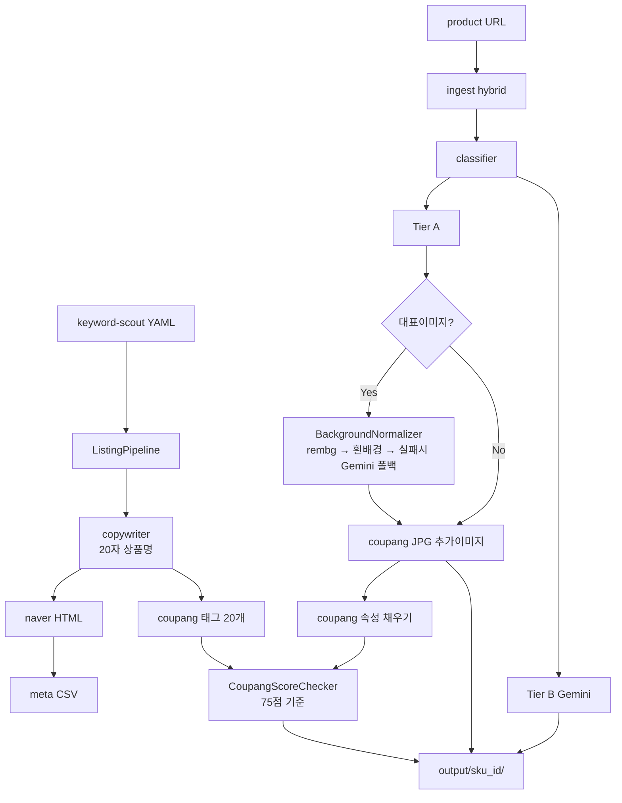

# Architecture — listing-forge

## 1. Context (A-1)

| 항목 | 내용 |
|---|---|
| **규모** | 1인 · CLI MVP → 로컬 웹 |
| **스타일** | **pipeline** (keyword-scout 동형) |
| **한 줄** | URL + keyword YAML → 수집 → 이미지 2단 → HTML/JPG 산출 |

**North Star**: clip-lens-page 수동 워크플로 **80% 자동화**.

## 2. Components (A-2)

| 컴포넌트 | 역할 | 경로 |
|---|---|---|
| **Config** | listing.yaml · env | `config/listing.yaml` |
| **CLI** | ingest / build | `scripts/build_listing.py` |
| **PublicParser** | og:image · JSON-LD · 알리 runParams | `src/ingest/public_parser.py` |
| **PlaywrightFetcher** | 로그인 세션 폴백 | `src/ingest/playwright_fetcher.py` |
| **ManualDrop** | ZIP/URL 목록 수동 | `src/ingest/manual_drop.py` |
| **ImageClassifier** | gallery/detail/junk · Tier A/B | `src/process/classifier.py` |
| **GeminiClient** | Tier B · 카피 | `src/process/gemini_client.py` |
| **BackgroundNormalizer** | 쿠팡 대표이미지 **흰 배경** 정규화 (rembg 누끼 → 순백 합성, 실패 시 Gemini 폴백) | `src/process/background_remover.py` |
| **Copywriter** | 한글 카피 · 상품명(20자 내외) | `src/process/copywriter.py` |
| **NaverRenderer** | Jinja HTML 2종 | `src/render/naver_html.py` |
| **CoupangExporter** | JPG 네이밍 · 대표/추가 이미지 배치 | `src/render/coupang_jpeg.py` |
| **CoupangAttributeFiller** | Rec.Attr 상품속성 채우기 | `src/render/coupang_attributes.py` |
| **CoupangTagGenerator** | 태그 20개 생성 (seed+related+Gemini 확장) | `src/render/coupang_tags.py` |
| **CsvMeta** | 네이버 CSV | `src/render/csv_meta.py` |
| **CoupangScoreChecker** | 상위노출 점수(75점 기준) 채점·리포트 | `src/score/coupang_score.py` |
| **Pipeline** | 오케스트레이션 | `src/pipeline.py` |
| **Reference** | clip-lens 샘플 | `reference/clip-lens-sample/` |

## 3. Data flow (A-3)



## 4. Trade-offs (A-4)

| 결정 | 선택 | 이유 |
|---|---|---|
| 수집 | hybrid 3단 | 봇 차단·1688 로그인 |
| 이미지 | Tier A/B 분리 | clip-lens 운영 경험 |
| UI | CLI 먼저 | keyword-scout 패턴 재사용 |
| 템플릿 | Jinja2 + reference HTML | naver-detail.html 검증됨 |
| scout 결합 | YAML 읽기만 (v1) | 느슨 결합 |
| 흰 배경 처리 | **rembg(로컬 세그멘테이션) → 실패 시 Gemini 이미지 편집 폴백** | hybrid ingest와 동일한 "로컬 우선·AI 폴백" 패턴 재사용, API 비용·속도 절감 |
| 점수제 판정 | **자동 계산 가능한 4항목만 자동 채점**, OTA FILL 등 육안 확인 항목은 체크리스트로 분리 | 오탐 방지 — scout risk 경고와 동일하게 "경고만, 강제 차단 안 함" 원칙 |

## 5. Patterns (A-5)

- **Pipeline** + artifact 폴더 (`output/{sku}_{date}/`)
- **Adapter** per marketplace (coupang/naver renderers)
- **Job manifest** JSON (재현·디버그)
- **Hybrid fallback** — ingest(public→playwright→manual)와 동일 원칙을 배경 정규화(rembg→Gemini)에도 적용
- **Scorecard** — 산출물 완성도를 수치화해 업로드 전 자가 검증 (`coupang_score_report.md`)

## 6. Review (A-6)

- [ ] clip-lens `naver-detail.html` 섹션 구조 = 템플릿 기본  
- [ ] CSV 컬럼 = `templates/naver_images_meta.sample.csv`  
- [ ] parity URL 1건 E2E 후 A-6 sign-off  
- [ ] 쿠팡 대표이미지 흰 배경 판정(`min_white_ratio`) 임계값 실제 크롤링 샘플로 튜닝  
- [ ] 쿠팡 점수 리포트 75점 미만 시 경고 문구 노출 확인  

## 7. 산출물 레이아웃 (갱신)

```
output/{sku_id}_{YYYYMMDD}/
├── source/                       # 원본 다운로드
├── coupang/
│   ├── 01_main_....jpg           # 대표이미지 — 흰 배경 필수 (BackgroundNormalizer 적용)
│   ├── 02_sub_....jpg ~ 06+      # 추가이미지 — 최소 5개
│   └── bg_normalize_report.json  # 배경 처리 로그 (원본/방식/성공여부)
├── coupang_meta/
│   ├── attributes.csv            # Rec.Attr 상품속성
│   ├── tags.json                 # 태그 20개
│   └── title.txt                 # 20자 내외 상품명
├── coupang_score_report.md       # 상위노출 점수 체크리스트 (75점 기준)
├── naver/
│   ├── detail_placeholders.html
│   └── detail_final.html
├── naver-store-images/
├── naver_images_meta.csv
├── manifest.json
└── DISCLAIMER.md
```
