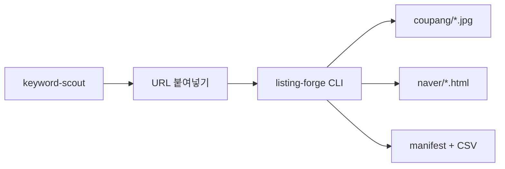

# PRD — listing-forge

> **한 줄**: keyword-scout로 고른 키워드·SKU에 대해 알리/1688 URL → **쿠팡 JPG** + **네이버 HTML 2종** 자동 생성.  
> **레퍼런스 이관**: `clip-lens-page` → `reference/clip-lens-sample/` (2026-07-03)

## 1. 문제·타겟

| | 내용 |
|---|---|
| **타겟** | 본인 — 쿠팡·네이버 스마트스토어 병행 소싱 |
| **Pain** | 키워드는 keyword-scout, **상세 이미지·한글화·HTML**은 clip-lens-page 수동(2~4h/SKU) |
| **현재 대안** | 수동 다운로드 · Canva · 에디터 직접 편집 |

## 2. 목표·성공 기준

| 유형 | 정의 |
|---|---|
| **North Star** | URL 1개 → 30분 내 업로드 가능 산출물 폴더 |
| **MVP** | 하이브리드 수집 · Tier A/B 이미지 · placeholder HTML · coupang JPG · CSV 메타 |
| **Parity** | `reference/clip-lens-sample` 알리 URL과 동등 품질 E2E 1회 |
| **Out of scope** | Wing/스마트스토어 API 자동 등록 · KC 단정 · 가격 동기화 |

## 3. 사용자 스토리

1. keyword-scout → 키워드 YAML 확정  
2. 1688/알리 URL 복사  
3. `python scripts/build_listing.py build --url ... --keyword-yaml ...`  
4. 쿠팡 JPG 업로드 · 네이버 placeholder HTML 붙여넣기  

## 4. 기능 Must / Won't

### Must

| ID | 기능 |
|:---:|---|
| F1 | 하이브리드 수집 (public → Playwright → manual_drop) |
| F2 | 이미지 gallery/detail/junk 분류 |
| F3 | Tier A 업스케일 · Tier B Gemini 한글화 |
| F4 | 한글 상세 카피 (scout 키워드·risk 반영) |
| F5 | 네이버 `detail_placeholders.html` + `detail_final.html` |
| F6 | 쿠팡 JPG + `naver_images_meta.csv` |
| F7 | keyword-scout `--keyword-yaml` 연동 |
| F8 | `manifest.json` + disclaimer |
| F9 | **쿠팡 대표이미지 흰 배경 정규화** — 크롤링 원본이 흰 배경이 아니면 제품은 그대로 두고 배경만 순백(#FFFFFF)으로 치환 |
| F10 | **쿠팡 상위노출 점수 체크리스트** — 75점 미만이면 업로드 전 경고 (§9 참고) |

### Won't (v1)

- 마켓 API 자동 등록  
- 1688 로그인 필수 전제  

### Later

- 로컬 웹 UI · 배치 · scout HTTP 연동  

## 5. 비기능

| 항목 | 요구 |
|---|---|
| API | Gemini 호출 상한 `max_tier_b_images` |
| 법무 | `DISCLAIMER.md` · risk 태그 경고 |
| 봇 | Playwright 실패 시 manual_drop 문서화 |

## 6. 아키텍처

> 정본: `./ARCHITECTURE.md`

## 7. Git · kickoff

| 단계 | 상태 |
|:---:|---|
| G-1~G-3 | kickoff 시 |
| A-1~A-6 | `ARCHITECTURE.md` |

## 8. 다음 액션

- [ ] Phase 1: PublicParser + Tier A + placeholder HTML  
- [ ] clip-lens parity URL E2E  
- [ ] Tier B Gemini + 카피 생성  

## 9. 쿠팡 상위노출 점수제 (F10)

> 정본 로직: `ARCHITECTURE.md` §2 CoupangScoreChecker · 가중치: `config/listing.yaml` → `coupang.ranking_score`

**최소 통과 기준: 75점 이상.** `build` 종료 시 `coupang_score_report.md`로 자동 채점하고, 75점 미만이면 콘솔·리포트에 경고를 남긴다 (등록 자체를 막지는 않음 — 최종 판단은 판매자).

| 항목 | 배점 | listing-forge 처리 방식 |
|---|:---:|---|
| OTA FILL 광고 노출 가능 컨텐츠 등록 | 20 | 자동 판정 불가 → **체크리스트 항목**으로 리포트에 표시, 수동 확인 유도 |
| Rec.Attr 상품속성 채우기 | 20 | `coupang_attributes.csv` 필수 속성 채움 여부로 자동 계산 |
| 태그 20개 채우기 | 20 | `coupang_tags.json` 개수(=20) 자동 계산 |
| 대표이미지 1개 + 추가이미지 최소 5개 | 20 | `coupang/` 폴더 파일 수 자동 계산 |
| 브랜드 제작 (가산점) | 20 | `keyword-scout` YAML `listing.brand_registered: true` 시 가산 |
| 20자 내외 상품명(핵심 키워드 포함) | 참고 | `coupang_title.txt` 생성 시 길이 제약(≤ `title_max_chars`) 강제 |
| 품질 높은 이미지 | 참고 | F3(Tier A/B) + F9(흰 배경) 결과물로 커버 |
| 메타태그 설정 | 참고 | 태그 20개 + `naver_images_meta.csv`의 검색키워드 컬럼으로 커버 |

> 참고 항목(배점 없음)은 브레이크다운 표에는 없지만 위 4개 필수 배점 항목 품질에 직접 영향을 준다.
